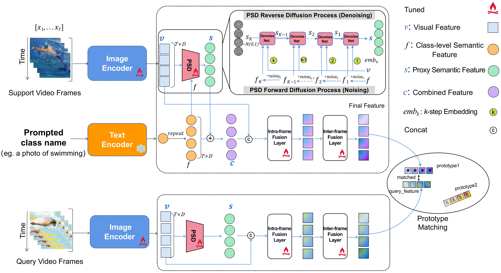

Official Pytorch Implementation of [ProLIPS]()



This code is based on [CLIPFSAR](https://github.com/alibaba-mmai-research/CLIP-FSAR) and [pytorch-video-understanding](https://github.com/alibaba-mmai-research/TAdaConv) codebase, which provides a comprehensive video understanding solution for video classification and temporal detection.

## Installation
Requirements:
- Python>=3.6
- torch>=1.5
- torchvision (version corresponding with torch)
- simplejson==3.11.1
- decord>=0.6.0
- pyyaml
- einops
- oss2
- psutil
- tqdm
- pandas

optional requirements
- fvcore (for flops calculation)

Or you can create environments with the following command:
```
conda env create -f environment.yaml
```

## Data preparation

First, you need to download the datasets from their original source (If you have already downloaded, please ignore this step
):

- [SSV2](https://20bn.com/datasets/something-something#download)
- [Kinetics](https://github.com/Showmax/kinetics-downloader)
- [UCF101](https://www.crcv.ucf.edu/data/UCF101.php)
- [HMDB51](https://serre-lab.clps.brown.edu/resource/hmdb-a-large-human-motion-database/#Downloads)

##Dataset Path
- [SSV2]
  - /dataset/Something_Something_V2
    - extracted_frames
      - id1
      - id2
    - labels
- [Kinetics] 700G
  - /dataset/Kinetics600
    - train
    - val
    - test
- [UCF101]
  - /userhome/Video_Data/ucf101
- [HMDB51]
  - /userhome/Video_Data/hmdb51

Then, prepare data according to the [splits](configs/projects/MoLo).

## Running
The entry file for all the runs are `runs/run.py`. 

Before running, some settings need to be configured in the config file. 
The codebase is designed to be experiment friendly for rapid development of new models and representation learning approaches, in that the config files are designed in a hierarchical way.

For an example run, open `configs/projects/ProLIPS/ssv2_full/ProLIPS_SSv2_Full_1shot_ours.yaml`

A. Set `DATA.DATA_ROOT_DIR` and `DATA.DATA_ANNO_DIR` to point to the kinetics dataset, 

B. Set the valid gpu number `NUM_GPUS`

Then the codebase can be run by (CUDA_VISIBLE_DEVICES can be modified) :
```
CUDA_VISIBLE_DEVICES=0,1,2,3 python runs/run.py --init_method=tcp://localhost:9994 --cfg configs/projects/ProLIPS/ssv2_full/ProLIPS_SSv2_Full_1shot_ours.yaml
```


